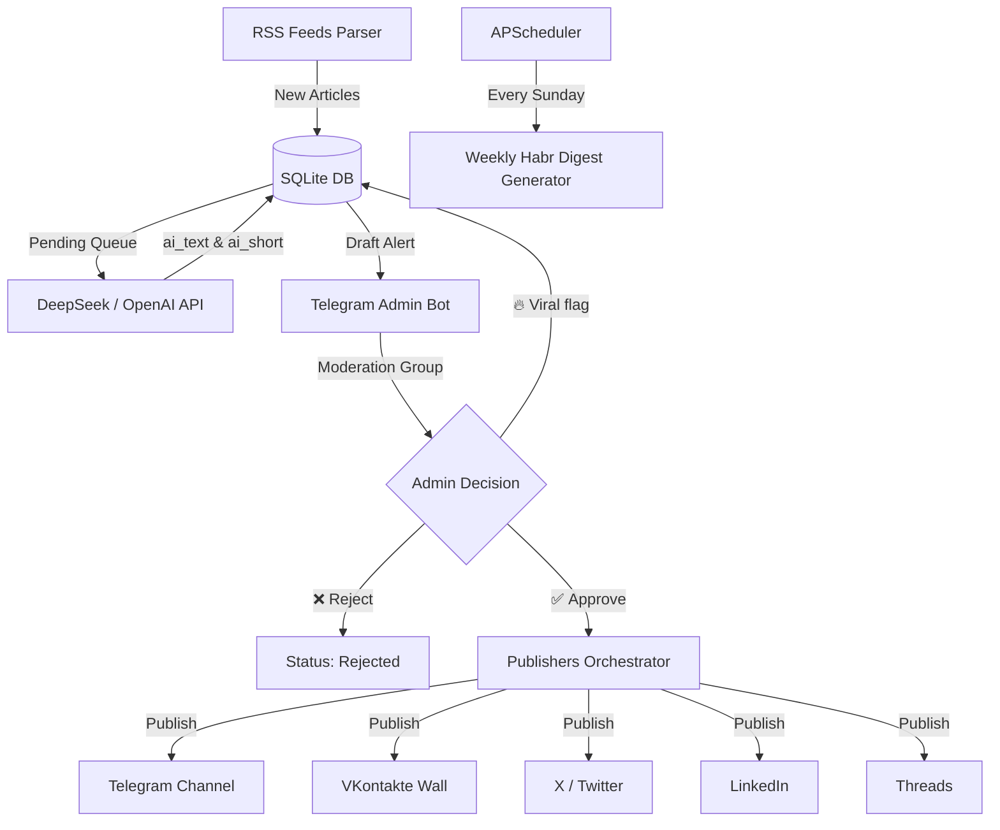
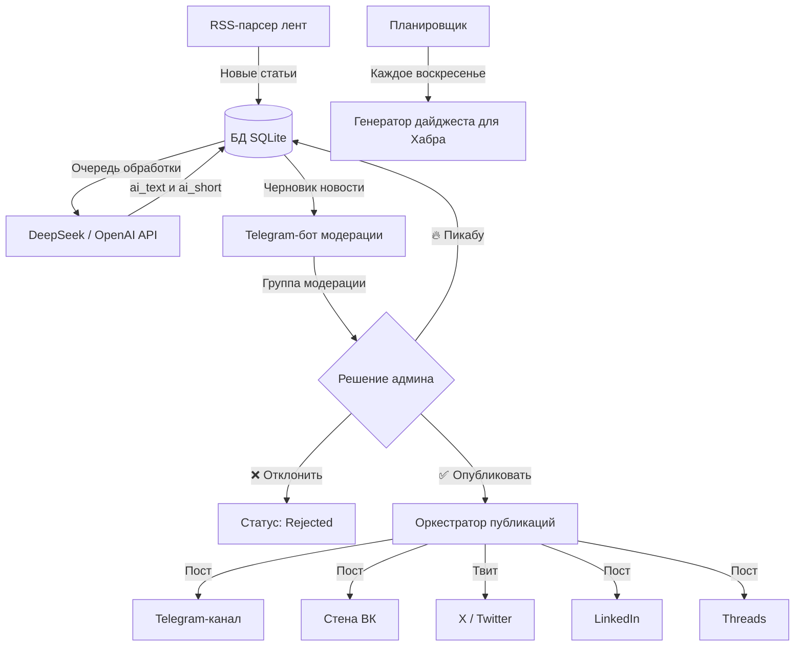

# CyberSentry: The Digital Whisper 🛡️💬

[Русский перевод ниже / Russian version below]

**CyberSentry: The Digital Whisper** is your personal, high-performance AI agent designed to dominate the cybersecurity information field. It monitors global threat feeds, translates and refines technical details using LLMs, and acts as an omni-channel publisher—all controlled via a sleek Telegram-based "Human-in-the-loop" moderation system.

The main objective is **Speed-to-Feed**: delivering critical infosec threat alerts to your professional audience (SOC analysts, blue/red teams, DevOps engineers) 2-3 hours faster than mainstream media.

---

## ⚡ Key Features

* **Smart RSS Parsing:** Continuously monitors key cybersecurity centers (BleepingComputer, The Hacker News, Securelist, Unit 42, Dark Reading, Krebs on Security).
* **AI Translation & Premium Rewrite:** Adapts content using DeepSeek/OpenAI, maintaining high technical accuracy (retains `CVE` numbers, `RCE`, `APT`, `IoC`, `LPE` terms) without watering it down.
* **Human-in-the-Loop Moderation:** Complete command center via a Telegram bot. Drafts are sent to a moderation group with inline buttons:
  * `✅ Approve` -> Publishes to all active platforms.
  * `❌ Reject` -> Discards the draft.
  * `🔥 Viral (Pikabu)` -> Marks the draft as trending/viral for custom community feeds.
* **Omni-Channel Auto-Publishing:** Once approved, posts are formatted and distributed to **Telegram**, **VKontakte**, **X (Twitter)**, **LinkedIn**, and **Threads**.
* **Habr Weekly Digest:** Gathers all approved posts from the past week, groups them by category (Vulnerabilities, Campaigns, Leaks, Tools), and generates a premium weekly recap ready for Habr.
* **System Alerting:** Instant notifications to the administrator if an API rate limit is hit, network times out, or a fatal error occurs.

---

## 🏗️ Architecture & Data Flow



---

## 🚀 Quick Start (Local Setup)

### Prerequisites
* Python 3.11+
* SQLite

### Installation

1. Clone the repository and navigate to the project directory:
   ```bash
   cd digital_whisper
   ```

2. Create a virtual environment and activate it:
   ```bash
   python3 -m venv .venv
   source .venv/bin/activate
   ```

3. Install dependencies:
   ```bash
   pip install -r requirements.txt
   ```

4. Create and configure your environment file:
   ```bash
   cp .env.example .env
   ```
   Open `.env` and fill in the required API keys (at least `TELEGRAM_BOT_TOKEN`, `ADMIN_CHAT_ID` (negative if group chat), `TELEGRAM_CHANNEL_ID`, and `DEEPSEEK_API_KEY` or `OPENAI_API_KEY`).

5. Run the application:
   ```bash
   python main.py
   ```

---

## 🐳 Docker Deployment

The application is fully containerized with Docker and structured for robust continuous execution.

```bash
# 1. Clone & copy env
cd digital_whisper
cp .env.example .env

# 2. Build and run in background
docker compose up --build -d

# 3. View live logs
docker compose logs -f
```

The database (`digital_whisper.db`) and log files (`logs/bot.log`) are persisted on the host machine using Docker Volumes.

---

<br>
<hr>
<br>

# CyberSentry: The Digital Whisper 🛡️💬

**CyberSentry: The Digital Whisper** — ваш личный высокопроизводительный ИИ-агент для доминирования в информационном поле кибербезопасности. Он осуществляет автоматический сбор новостей с зарубежных источников, делает профессиональный перевод и рерайт с помощью LLM, и автоматически публикует одобренный контент на несколько платформ — всё это под контролем удобного Telegram-бота в режиме "Human-in-the-loop".

Миссия проекта — **Speed-to-Feed**: доставка критически важных алертов и новостей ИБ-сообществу (SOC-аналитикам, Blue/Red Team специалистам, DevOps-инженерам) на 2-3 часа раньше классических новостных ресурсов.

---

## ⚡ Ключевые Возможности

* **Умный парсинг:** Мониторинг ключевых мировых ИБ-центров (BleepingComputer, The Hacker News, Securelist, Unit 42, Dark Reading, Krebs on Security).
* **ИИ-рерайт премиум-класса:** Адаптация через DeepSeek/OpenAI с полным сохранением технической терминологии (`CVE-XXXX-XXXXX`, `RCE`, `APT`, `IoC`, `LPE`, `CVSS`, `PoC`), исключая «опопсение» деталей.
* **Система модерации (Human-in-the-loop):** Полный контроль публикаций через Telegram-бот. Черновики отправляются в админ-чат с кнопками:
  * `✅ Опубликовать` -> Мгновенная публикация на все активные платформы.
  * `❌ Отклонить` -> Пометка новости как отклонённой.
  * `🔥 На Пикабу` -> Флаг вирусного контента для разгона на развлекательных площадках.
* **Омниканальный мультипостинг:** После одобрения пост автоматически рассылается в **Telegram-канал**, **ВКонтакте**, **X (Twitter)**, **LinkedIn** и **Threads**.
* **Дайджесты для Хабра:** Каждое воскресенье бот собирает все опубликованные статьи за неделю, группирует по категориям (Уязвимости, APT-кампании, Утечки, Инструменты) и генерирует готовый Markdown-пост для Хабра.
* **Мгновенный алертинг:** Бот немедленно пришлет системное оповещение с трейсбэком ошибки в чат администратора при сбое API, тайм-аутах или падении сервисов.

---

## 🏗️ Архитектура и поток данных



---

## 🚀 Быстрый старт (Локальный запуск)

### Системные требования
* Python 3.11+
* SQLite

### Установка

1. Перейдите в директорию проекта:
   ```bash
   cd digital_whisper
   ```

2. Создайте и активируйте виртуальное окружение:
   ```bash
   python3 -m venv .venv
   source .venv/bin/activate
   ```

3. Установите зависимости:
   ```bash
   pip install -r requirements.txt
   ```

4. Создайте конфигурационный файл `.env`:
   ```bash
   cp .env.example .env
   ```
   Откройте `.env` и укажите ваши API-ключи (минимум требуются: `TELEGRAM_BOT_TOKEN`, `ADMIN_CHAT_ID` (отрицательный, если это группа), `TELEGRAM_CHANNEL_ID` и `DEEPSEEK_API_KEY` или `OPENAI_API_KEY`).

5. Запустите приложение:
   ```bash
   python main.py
   ```

---

## 🐳 Развертывание в Docker

Приложение полностью контейнеризировано и подготовлено для непрерывной и отказоустойчивой работы.

```bash
# 1. Перейдите в папку и создайте env
cd digital_whisper
cp .env.example .env

# 2. Соберите и запустите контейнер в фоне
docker compose up --build -d

# 3. Просмотр логов в реальном времени
docker compose logs -f
```

База данных SQLite (`digital_whisper.db`) и папка логов (`logs/bot.log`) монтируются на хост-машину через Docker Volumes для сохранности ваших данных.
